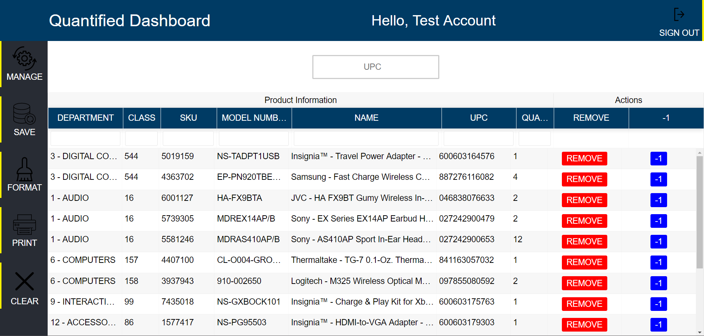
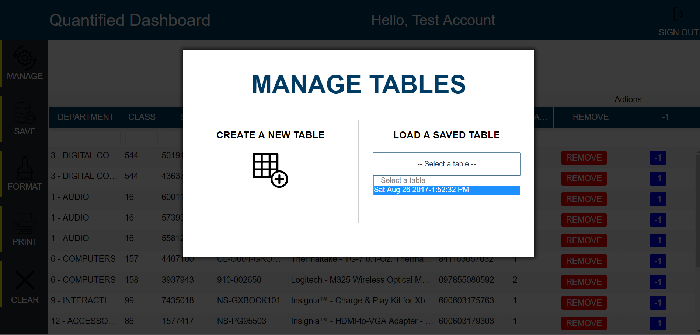
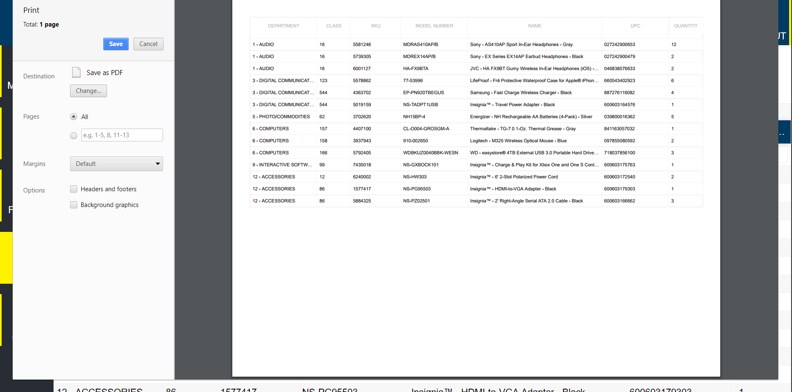

# Quantified (bby-react)

## About
This is the front end for [bby-react-api](https://github.com/chrstntdd/bby-react-api).

All together these two repositories make up [Quantified](https://developer-madeline-27128.netlify.com/).
Quantified is a complete rewrite/overhaul of [this](https://github.com/chrstntdd/bby-app) prototype application. Quantified is a utility to help reduce shrink and improve accuracy in a retail setting where human error when reading UPCs, SKUs, or model numbers can occur and have costly consequences. Quantified lets users (Employees) organize product data into a filterable and print-ready table by scanning the a UPC barcode to add it to the table. Additionally, the table can (and should) be formatted/ordered before printing to make viewing all the data more comprehensible. New to this project is the ability to save and load tables instead of having the table and all the data exist only for the duration of the browser session. 

## Screenshots

## Front End Technology
+ React
+ Redux
+ Jest (w/ Enzyme)
+ SCSS
+ [FuseBox](https://github.com/fuse-box/fuse-box)

## Back End Technology

+ TypeScript
+ NodeJs (Express)
+ MongoDB (Mongoose)
+ Bcrypt
+ JSON Web Tokens
+ Mocha (w/ Chai)
+ [Best Buy API ](https://github.com/BestBuyAPIs/bestbuy-sdk-js)

## API Documentation

The API is simple. There are routes for Users, Tables, and one for making the call to the Best Buy API.

### UserRouter `@path = '/api/v1/users`
GET
+ `/` get all users
+ `/:id` get user by id

POST
+ `/` sign up handler
+ `/sign-in` sign in handler
+ `/verify-email/:token` verify email handler
+ `/forgot-password` forgot password handler
+ `/reset-password/:token` reset password handler

PUT
+ `/:id` update user by id

DELETE
+ `/:id` delete user by id

---

### Table Router `@path = '/api/v1/tables'`
*NOTE: All of these endpoints require a valid JWT issued by a successful sign in*

GET
+ `/:userId` get all tables for a user by id
+ `/:userId/:tableId` get single table for user by table id and user id

POST
+ `/:userId/` create a single table for user by id

PUT
+ `/:userId/:tableId` update a single table for user by table id and user id

DELETE
+ `/:userId/:tableId` delete a single table for user by table id and user id

---

### Best Buy Router `@path = '/api/v1/best-buy'`
*NOTE: This endpoint also requires a valid JWT issued by a successful sign in*

POST
+ `/upc` takes upc string and returns product information from the best buy API if the UPC is valid

---